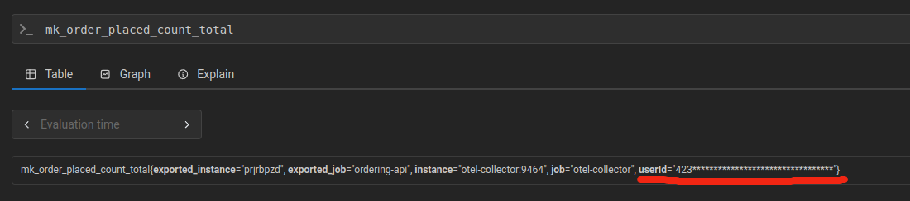
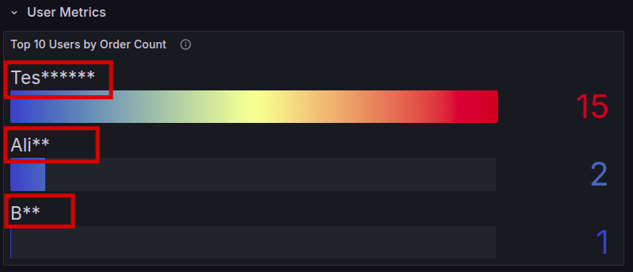
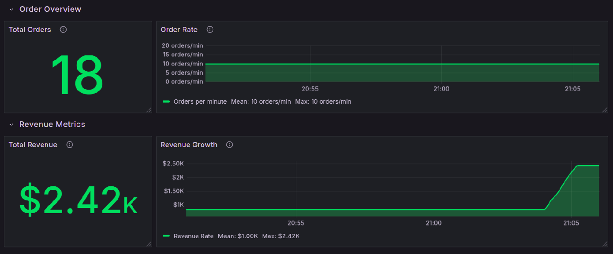
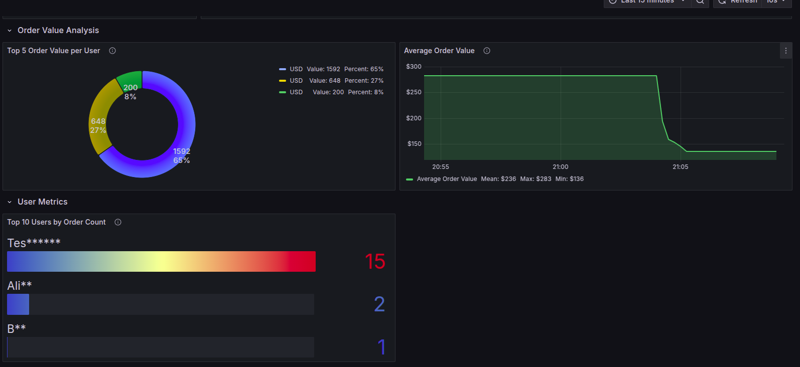
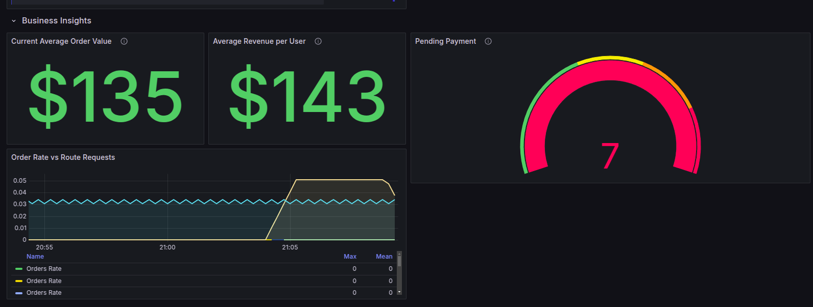
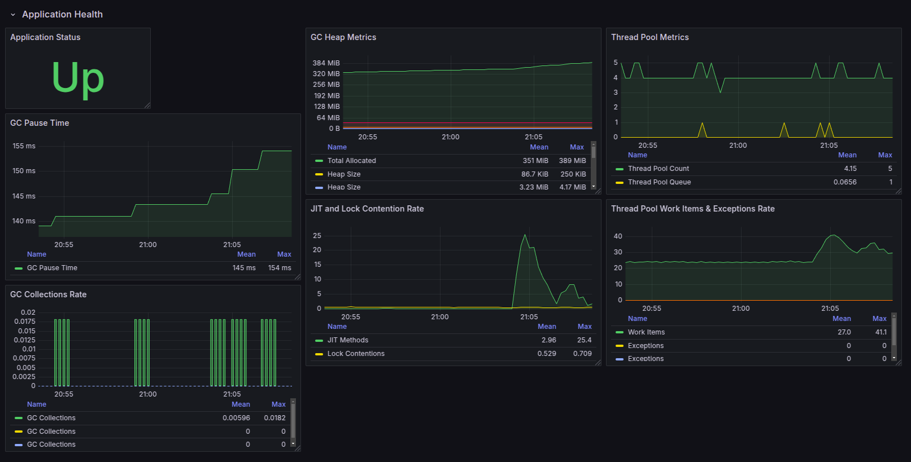
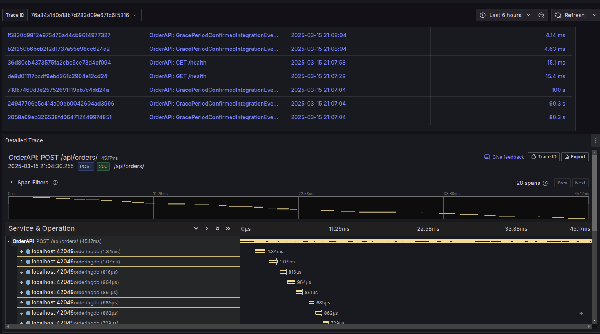
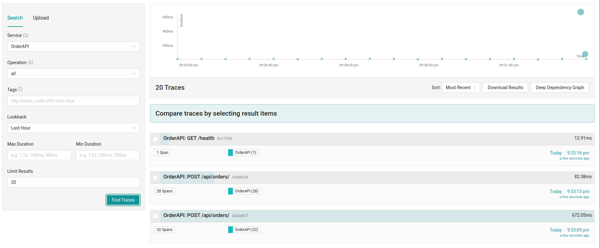

# Integrating OpenTelemetry & Security in eShop

## 1. Introduction

This report documents the implementation of OpenTelemetry tracing and security features in the eShop application for Assignment 02.02. The implementation focused on enhancing the Order processing feature with end-to-end tracing, sensitive data protection, and visualization through Grafana dashboards. The project also explored the additional security measures, which includes data logs encryption and column masking.

## 2. Implementation Overview

### 2.1. Feature Selection: Order Processing Flow

The implementation focused on the Order creation and processing flow, which involves multiple microservices and represents a critical business operation. This feature was selected because:

- It processes sensitive customer data (credit card information, personal details)
- It spans multiple services (BasketAPI, OrderingAPI...)
- It has clear transaction boundaries (in the command handlers)
- It's a complete end-to-end business process with multiple status changes

### 2.2. OpenTelemetry Integration

The following components were implemented to enable comprehensive tracing and monitoring:

#### 2.2.1. Tracing and Metrics Infrastructure

```csharp
// From Program.cs
builder.Services.AddOpenTelemetry()
    .WithTracing(tracerProviderBuilder =>
    {
        tracerProviderBuilder
            .SetResourceBuilder(ResourceBuilder.CreateDefault().AddService("OrderAPI"))
            .AddAspNetCoreInstrumentation()
            .AddHttpClientInstrumentation()
            .AddConsoleExporter()
            .AddJaegerExporter(options =>
            {
                options.AgentHost = jaegerHost;
                options.AgentPort = jaegerPort;
            });
    })
    .WithMetrics(metrics =>
    {
        metrics
            .AddAspNetCoreInstrumentation()
            .AddHttpClientInstrumentation()
            .AddMeter("Ordering.API")
            .AddOtlpExporter(options =>
            {
                options.Endpoint = new Uri(opentelemetryCollectorUrl);
            });
    });

```

A dedicated `ActivitySource` was created for the Ordering service to enable custom spans:

```csharp
// From OrdersApi.cs
private static readonly ActivitySource ActivitySource = new("eShop.Ordering", "1.0.0");
```

#### 2.2.2. Metrics Collection

Custom metrics were implemented to track:

- Order placed count
- Active orders count
- Total purchase amount
- Order value
- Total revenue
- Order item quantity
- Orders by user

```csharp
// From Program.cs
var meter = new Meter("Ordering.API");
builder.Services.AddSingleton(meter);
builder.Services.AddSingleton(meter.CreateCounter<long>("mk_order_placed_count", 
    description: "Número total de orders."));
builder.Services.AddSingleton(meter.CreateGauge<int>("mk_active_orders", 
    description: "Número de orders ativas."));
builder.Services.AddSingleton(meter.CreateHistogram<double>("mk_total_purchase_amount", unit: "USD",
    description: "Soma total das compras feitas."));
builder.Services.AddSingleton(meter.CreateHistogram<double>("mk_order_value", unit: "USD",
    description: "Valor de uma order."));
builder.Services.AddSingleton(meter.CreateCounter<double>("mk_total_revenue", unit: "USD",
    description: "Receita total."));
builder.Services.AddSingleton(meter.CreateCounter<int>("mk_order_item_quantity",
    description: "Quantidade de items em uma order."));
builder.Services.AddSingleton(meter.CreateCounter<int>("mk_orders_by_user",
    description: "Número de orders por usuário."));
```
The prefix `mk_` was just used to distinguish custom metrics from other metrics.

### 2.3. Data Sensitivity Protection

#### 2.3.1. Masking Sensitive Data

Sensitive data masking was implemented in multiple layers:

1. **Credit Card Masking**: In `CreateOrderAsync` method in `OrdersApi.cs`:

```csharp
var maskedCCNumber = request.CardNumber.Substring(request.CardNumber.Length - 4)
    .PadLeft(request.CardNumber.Length, 'X');
```

2. **User Identification Masking**: In `CreateOrderCommandHandler.cs`:

```csharp
private static string MaskString(string value)
    {
        if (string.IsNullOrEmpty(value))
            return value;

        if (value.Length <= 3)
        {
            return value[0] + new string('*', value.Length - 1);
        }

        return value.Substring(0, 3) + new string('*', value.Length - 3);
    }
```

3. **Metrics Tags Masking**: When recording metrics, sensitive data is masked:

```csharp
_orderValueHistogram.Record(totalAmount, 
    new KeyValuePair<string, object>("userId", MaskString(message.UserId)));
```
This enabled me to mask the `userId` tag in the metrics, as it can be seen in the image below:

Or even in the dashboard, data such as UserName was also masked:

The masked data could have been other sensitive data, such as the card number, but as it is not exposed, the name was chosen to demonstrate the masking.

#### 2.3.2. Log Scrubbing

Logging was already modified to avoid recording sensitive information:

```csharp
// From CreateOrderAsync in OrdersApi.cs
services.Logger.LogInformation(
    "Sending command: {CommandName} - {IdProperty}: {CommandId}",
    request.GetGenericTypeName(),
    nameof(request.UserId),
    request.UserId); //don't log the request as it has CC number
```

### 2.4. Security & Compliance Implementation

#### 2.4.1. Database Layer Security

1. **User Role Separation**: Different database roles were created with specific permissions for each service:

```sql
-- From deploy/postgres/init-roles.sql
CREATE ROLE catalog_user WITH LOGIN PASSWORD 'pass_catalog';
CREATE ROLE identity_user WITH LOGIN PASSWORD 'pass_identity';
CREATE ROLE ordering_user WITH LOGIN PASSWORD 'pass_ordering';
CREATE ROLE webhooks_user WITH LOGIN PASSWORD 'pass_webhooks';
```

2. **Database Separation**: Each service gets its own database with specific permissions:

```sql
CREATE DATABASE catalogdb;
CREATE DATABASE identitydb;
CREATE DATABASE orderingdb;
CREATE DATABASE webhooksdb;
```

#### 2.4.2. Secure Connection Strings

Connection strings were properly secured in configuration files and environment variables:

```csharp
// From src/eShop.AppHost/Program.cs
.WithEnvironment("ConnectionString", 
    "Host=postgres;Database=orderingdb;Username=ordering_user;Password=pass_ordering;");
```

## 3. Observability Setup

### 3.1. Tracing & Metrics Visualization

The implementation includes:

1. **Docker Container Setup**: Using OpenTelemetry collector, Jaeger, Prometheus, and Grafana

```yaml
# From docker-compose.yml

services:
  otel-collector:
    image: otel/opentelemetry-collector-contrib:latest
    container_name: otel-collector
    command: ["--config=/etc/otel-collector-config.yaml"]
    volumes:
      - ./otel-collector-config.yaml:/etc/otel-collector-config.yaml
    ports:
      - "4317:4317"   # OTLP gRPC
      - "4318:4318"   # OTLP HTTP
      - "9464:9464"   # Expor métricas para Prometheus
      - "14269:14268" # Recebimento de spans via OTLP (alterado para 14269)

  prometheus:
    image: prom/prometheus:latest
    container_name: prometheus
    volumes:
      - ./prometheus.yml:/etc/prometheus/prometheus.yml
    ports:
      - "9090:9090"  # UI do Prometheus

  grafana:
    image: grafana/grafana:latest
    container_name: grafana
    ports:
      - "3000:3000"  # UI do Grafana
    environment:
      - GF_SECURITY_ADMIN_PASSWORD=admin
    volumes:
      - ./grafana/provisioning:/etc/grafana/provisioning
      - ./grafana/dashboards:/var/lib/grafana/dashboards

  jaeger:
    image: jaegertracing/jaeger:2.3.0
    container_name: jaeger
    ports:
      - "6831:6831/udp"  # Jaeger UDP for spans
      - "16686:16686"    # Jaeger UI
    environment:
      - COLLECTOR_ZIPKIN_HTTP_PORT=9411  # Enable Zipkin format support
      - LOG_LEVEL=debug

```

2. **Metrics Collection Configuration**: Using OpenTelemetry Protocol (OTLP)

```yaml
# From otel-collector-config.yaml
receivers:
  otlp:
    protocols:
      grpc:
        endpoint: "0.0.0.0:4317"
      http:
        endpoint: "0.0.0.0:4318"

exporters:
  prometheus:
    endpoint: "0.0.0.0:9464" 

  debug:
    verbosity: detailed

service:
  pipelines:
    traces:
      receivers: [otlp]
      exporters: [debug]
    metrics:
      receivers: [otlp]
      exporters: [prometheus]
  telemetry:
    logs:
      level: "debug"
```

3. **Prometheus Configuration**: For scraping metrics

```yaml
# From prometheus.yml
global:
  scrape_interval: 5s

scrape_configs:
  - job_name: "otel-collector"
    static_configs:
      - targets: ["otel-collector:9464"]
```

### 3.2. Grafana dashboards

To visualize the metrics and traces, 3 Grafana dashboards were created:

#### Ordering Metrics Dashboard

The Grafana dashboard created shows multiple important metrics:
1. **Order Overview**: Shows total orders and order rate over time
2. **Revenue Metrics**: Displays total revenue and revenue growth over time


3. **Order Value Analysis**: Shows top order values by user and average order value over time
4. **User Metrics**: Displays top users by order count


5. **Business Insights**: Shows key metrics like current average order value, average revenue per user, and active order monitoring


#### Application Health Dashboard

The Application Health dashboard shows the metrics related to the application health, most of these metrics are available by default in the OpenTelemetry Collector, the most usefull are:
1. **Application Health**: Shows the health of the application
2. **CPU Usage** (Threads): Shows the CPU usage of the application
3. **Memory Usage** (Heap): Shows the memory usage of the application


#### Jaeger Tracing Dashboard

The Jaeger Tracing dashboard shows the traces of the application, this dashboard is very useful since it aggregates all the traces from Jaeger into a single platform (Grafana). It is composed of 2 panels:
1. **Table of Traces**: Shows the traces of the application
2. **Trace Statistics**: Shows the statistics of the traces
By clicking on a trace in the table of traces, the trace statistics will be updated with the information of the selected trace.

The image below shows the tracing dashboard:

The information of this dashboard can also be viewed in the Jaeger UI, but since we are using Grafana to visualize the metrics, it is more convenient to have all the information in a single platform. The Jaeger UI is shown in the image below:


## 4. Load Testing

A load testing script was created to generate realistic traffic and test the monitoring capabilities:

```bash
# From loadtests/order-load-test.sh
#!/bin/bash

API_URL="http://localhost:5224"

NUM_REQUESTS=25

DELAY=5

send_order_request() {
    request_id=$(uuidgen) 
    
    body=$(cat <<EOF
{
    "userId": "$random_user_id",
    "userName": "Test User",
    "city": "Seattle",
    "street": "123 Main St",
    "state": "WA",
    "country": "USA",
    "cardNumber": "4111111111111111",
    "cardHolderName": "Test User",
    "cardExpiration": "$expiration_date",
    "cardSecurityNumber": "123",
    "cardTypeId": 1,
    "buyer": "Test Buyer",
    "items": [
        {
            "productId": "$((RANDOM % 100 + 1))",
            "productName": "Test Product",
            "unitPrice": "$((RANDOM % 100 + 1)).99",
            "quantity": 2
        }
    ]
}
EOF
)

    response=$(curl -s -o /dev/null -w "%{http_code}" -X POST "$API_URL/api/orders?api-version=1.0" \
        -H "Content-Type: application/json" \
        -H "x-requestid: $request_id" \
        -d "$body")
}
```
This script sends a POST request to the Order API with a sample order payload. The script was executed with 25 requests to simulate a moderate load on the system.

## 5. Sensitive Data Protection

An interesting fact about this application is that it already had some sensitive data protection implemented, such as:

1. **JSON Sanitization**: A utility in the `OrderingTelemetryService` class to sanitize JSON payloads before logging

```csharp
// From OrderingTelemetryService
public string SanitizeJsonPayload(string json)
{
    try
    {
        var doc = JsonDocument.Parse(json);
        using var outputStream = new MemoryStream();
        using var writer = new Utf8JsonWriter(outputStream, new JsonWriterOptions { Indented = false });
        
        SanitizeJsonElement(doc.RootElement, writer);
        
        writer.Flush();
        return System.Text.Encoding.UTF8.GetString(outputStream.ToArray());
    }
    catch (Exception ex)
    {
        _logger.LogWarning(ex, "Failed to sanitize JSON payload");
        return "*** Sanitized Content ***";
    }
}
```

2. **Property-based Sanitization**: Detection of sensitive property names

```csharp
private bool IsSensitiveProperty(string propertyName)
{
    // Define sensitive property names
    var sensitiveProperties = new[]
    {
        "cardnumber", "cardNumber", "card_number",
        "cvv", "securitycode", "securityNumber", "security_number",
        "password", "secret", "token", "key",
        "ssn", "socialSecurity", "social_security"
    };
    
    return sensitiveProperties.Any(p => 
        propertyName.Equals(p, StringComparison.OrdinalIgnoreCase));
}
```

## 6. Conclusion and Recommendations

### 6.1. Implementation Achievements

The implementation successfully added:

1. End-to-end tracing for the Order processing workflow
2. Protection of sensitive data in logs, metrics, and traces
3. Visualization of key metrics and traces in Grafana
4. Database security with role-based access control
5. Load testing for validating the monitoring setup

### 6.2. Further Improvements

To enhance the current implementation, the following improvements could be considered:

1. **Expand Tracing Coverage**: Extend tracing to include other microservices like Basket and Catalog
2. **Enhanced Security**: Implement data encryption at rest using native PostgreSQL encryption
3. **Role-based Data Masking**: Implement dynamic data masking based on user roles
4. **Alerting**: Configure alerts based on metrics thresholds

### 6.3. Conclusion

This project enabled me to gain hands-on experience observability tools and security practices, which are essential for building secure and reliable software systems.
The most difficult part of the project was to understand this new environment, with new tools and technologies, but after understanding the basics (which took some time), the implementation was very smooth.

## Links

Github Repository: https://github.com/AlexandreCotorobai/eShop
 - docker-compose.yml, otel-collector-config.yaml, prometheus.yml are inside the root folder
 - Loadtests are inside the loadtests folder
 - Database scripts are inside the deploy folder
 - Grafana dashboards are inside the grafana folder
 - Report and diagrams are inside the report folder

## How to run
- ``docker compose up --build`` inside the root folder
- ``dotnet run --project src/eShop.AppHost/eShop.AppHost.cspro`` inside the root folder
- ``chmod +x ./loadtests/order-load-test.sh``
- ``./loadtests/order-load-test.sh``
